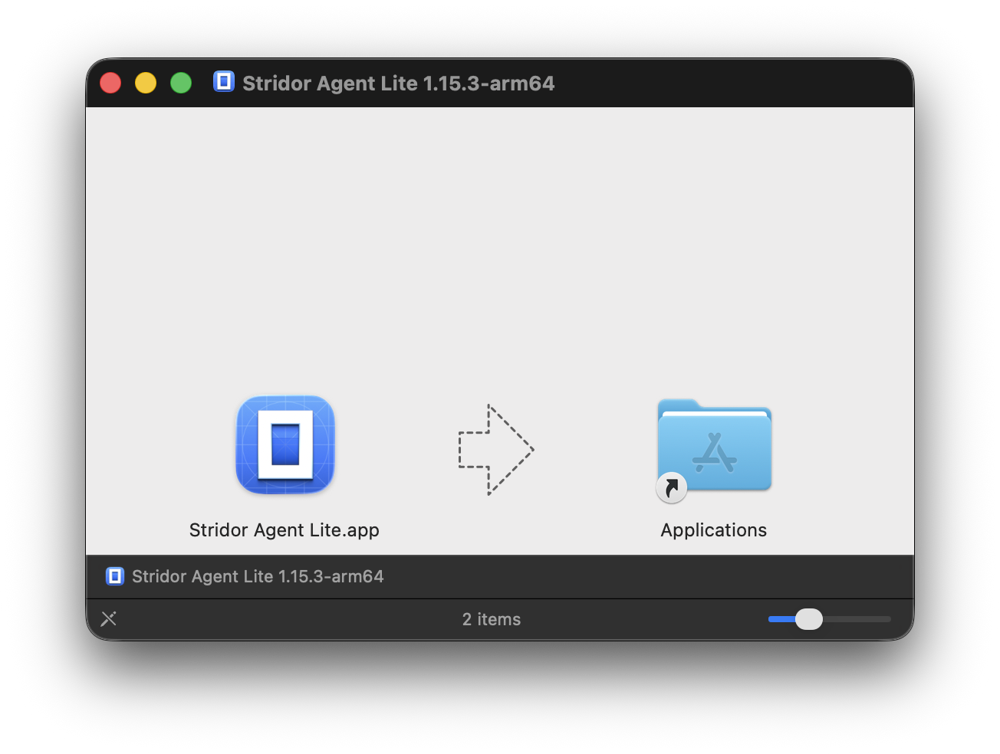
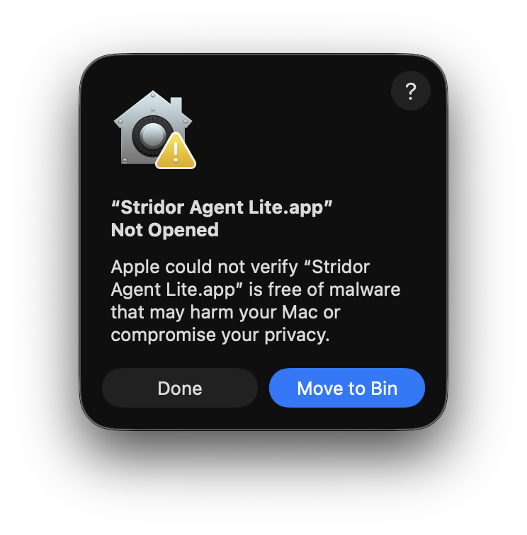
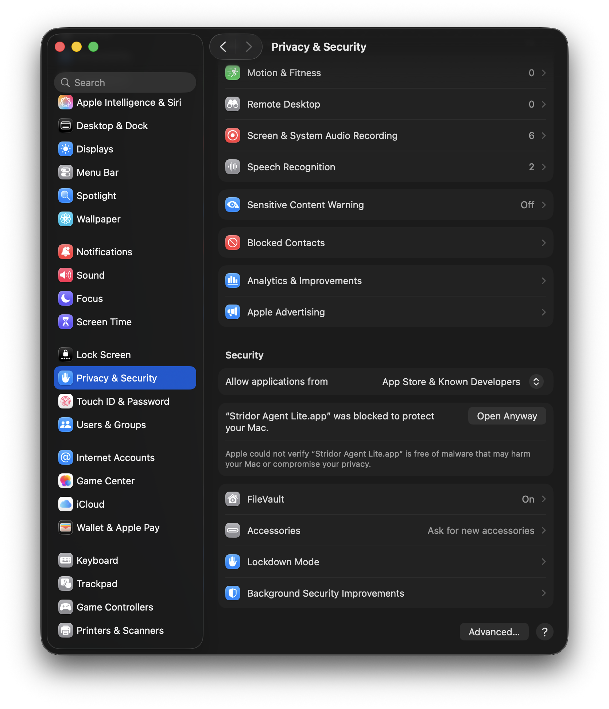
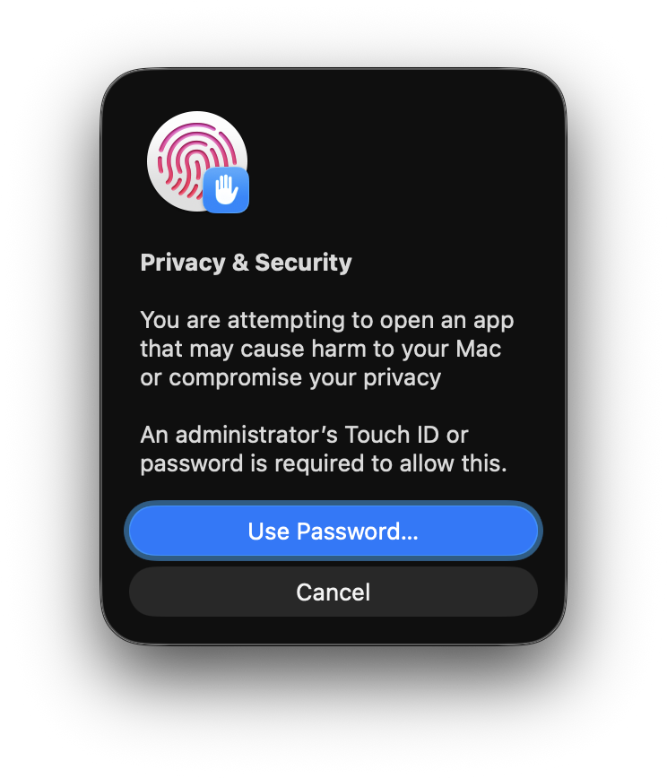
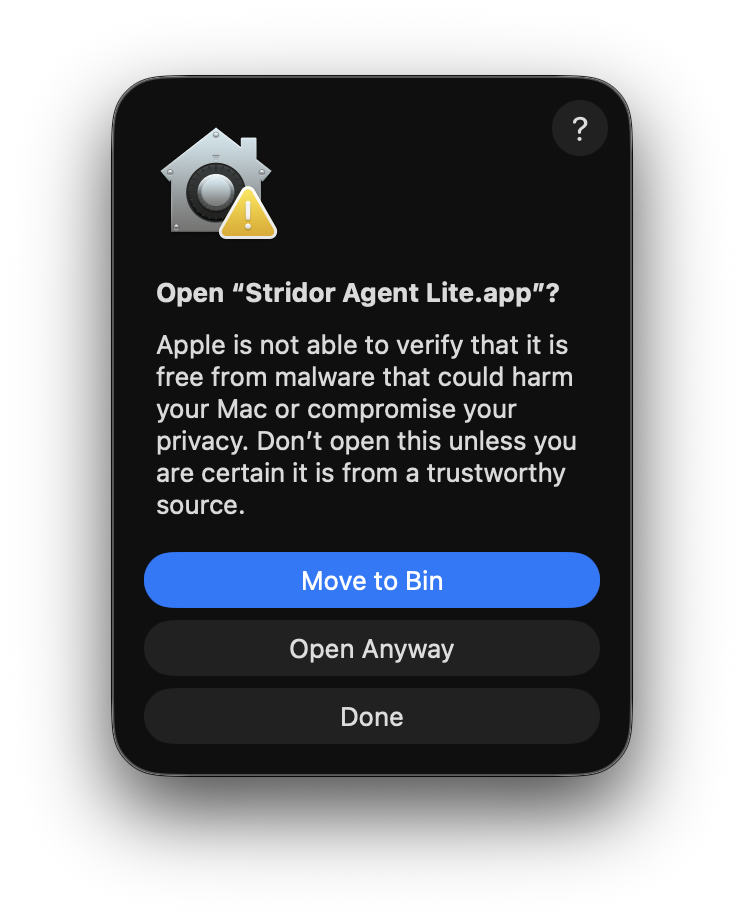
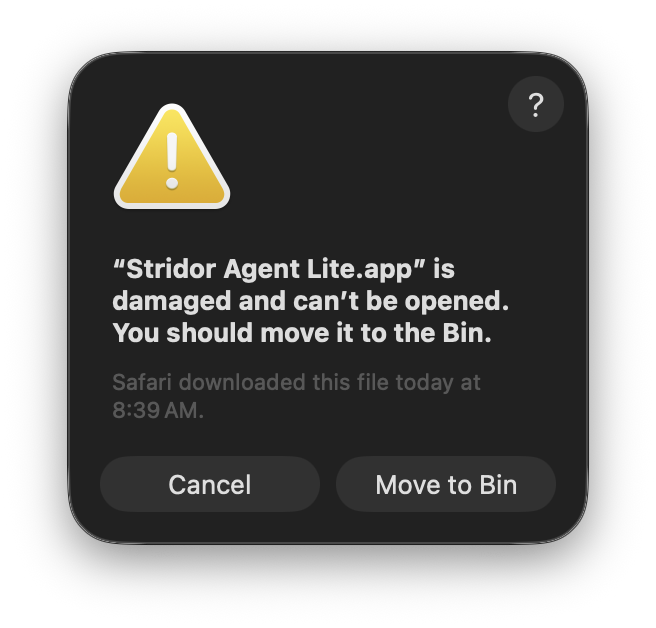

# Installing Stridor Agent Lite

This guide is for the macOS development beta of Stridor Agent Lite.

Because this is still a development release, macOS may ask you to confirm that you want to open the app. That is expected for this beta. Follow the steps below.

## 1. Download the macOS Build

Go to the [Stridor Agent Lite Releases page](https://github.com/Stridor-Intelligence/stridor-agent-lite-release/releases) and download the correct macOS build for your Mac.

- Apple Silicon: M1, M2, M3, M4 and newer Macs
- Intel: older Intel-based Macs

## 2. Open the Downloaded File

After the download finishes, open the `.dmg` file.

You should see a window like this:

## 3. Drag Stridor Agent Lite into Applications

Drag **Stridor Agent Lite.app** onto the **Applications** folder in the same window.

When the copy finishes, open your **Applications** folder and double-click **Stridor Agent Lite**.

## 4. If macOS Says the App Was Not Opened

The first time you open the app, macOS may show this message:

Click **Done**.

Do not click **Move to Bin**.

## 5. Open Privacy & Security

Open **System Settings**, then click **Privacy & Security** in the left sidebar.

Scroll down to the **Security** section. You should see a message saying that **Stridor Agent Lite.app** was blocked to protect your Mac.

Click **Open Anyway**.

## 6. Confirm With Your Mac Password

macOS may ask for your administrator password or Touch ID.

Click **Use Password...** and enter your Mac password.

## 7. Click Open Anyway

macOS will ask one final time whether you want to open **Stridor Agent Lite.app**.

Click **Open Anyway**.

Stridor Agent Lite should now open.

## Troubleshooting

### If You See "Damaged and Can't Be Opened"

If macOS says **"Stridor Agent Lite.app" is damaged and can't be opened**, you are probably using an older development build.

Click **Cancel**, delete that copy of the app, then download the latest build from the [Releases page](https://github.com/Stridor-Intelligence/stridor-agent-lite-release/releases).

If the latest build still shows this message, wait for the next release note or contact Stridor support. This message is a packaging/signing issue, not something you should have to fix manually.

### Windows

Windows is not available yet. Join the Windows waiting list from the Stridor website when it opens.
